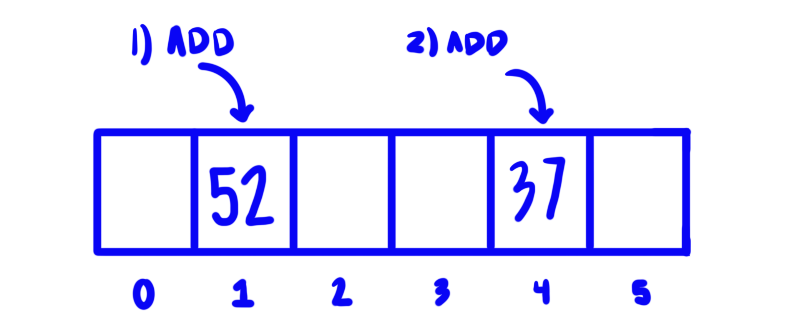

# Sets
## I. Introduction
Another useful data structure to help solve unique problems is a set. A set is a collection of unique values that allows us to quickly add, remove, or test for membership. 

## II. Hashing
A set is able to perform the way it does by using a method called hashing. The idea for the set is that given a value it will systematically be placed in an array at a certain index. Then when checking for this value in the array we can look at that specific index to find it rather than searching the whole array. Sets are not ordered. We can see in the image below that a simple example of a set could have 52 at index 1 and 37 at index 4. The way an index is found for a set is through hashing.\


```c#
var mySet = new HashSet<int>();

// When added to a set they will not appear in any particular order.
mySet.Add(52);
mySet.Add(37);
```

Hashing is a built-in method in C# that returns an integer based on the given *value* regardless of the data type. This is done with the method ```value.GetHashCode()```. However, we can't just use that hash code alone for the index in our array. The final formula will look more like ```hash(data) % sparseArraySize```. The hash function will not always result in the same value, but it will be consistent across a run time. \
This is also why sets will not allow duplicates. The value 52 already exists and there is no reason to add it twice to the same index.

## Conflict Resolution
We can see that the method for how we assign the specific index can lead to some conflicts. When these conflicts arise we have two common ways of dealing with them. \
The first is called open addressing. With open addressing, when something is already at the index where the new item would go this process would tell the program to put the new value into the next open space. Unfortunately, this method is not perfect and can quickly result in more and more confilcts.\
Our other option is chaining. Rather than find an open index to store the variable, it simply has a list occupy the space at the conflict index. \
Both conflict resolution methods can cause not as desirable effects on our algorithmic efficiency and can cause the data structure to approach O(n). The solution to this is typically to increase the size of the sparse array.
## Mapping
The set data structure is also commonly used in creating maps. Maps also reffered to as dictionaries allow for us to build out look-up tables, relations, and even objects. This expands the number of problems we can solve using sets by allowing us more flexibility in how we store information and the amount of information. In maps we can have a unique key and a corresponding value. The unique key similar to our hash index for our regular sets allows us to quickly look up values in our mapping.\

## Common Operations
The common operations involved with a regular set are displayed in the table below:
| C# Code                      | Description                            |
|------------------------------|----------------------------------------|
| ```mySet.Add(value)```      | Adds the "value" to mySet.             |
| ```mySet.Remove(value)```   | Removes the "value" from mySet.        |
| ```mySet.Contains(value)``` | Checks if the "value" exists in mySet. |
| ```mySet.Count```           | Returns the size of mySet.             |

There are similar methods associated with maps listed in the table below:
| C# Code                                                  | Description                                                                                                                            |
|----------------------------------------------------------|----------------------------------------------------------------------------------------------------------------------------------------|
| ```myMap.Add(key, value)``` or  ```myMap[key] = value``` | If the key does not already exist,  this adds a new entry with this key  and value. Otherwise, it updates the key with the new value. |
| ```myMap[key]```                                         | Returns the value corresponding to the  key.                                                                                           |
| ```myMap.Remove(key)```                                  | Removes the entire row of data  corresponding to the key from myMap.                                                                   |
| ```myMap.ContainsKey(key)```                             | Checks if the key is a member of myMap.                                                                                                |
## Efficiency of common operations
The data structure of the set, similar to the stack is efficient at executing its primary methods. The algorithmic efficiency of our Add, Remove, and Contains methods are O(1). However, this is dependent on the conflict resolution strategy the set uses. In the examples and problems to solve, we will assume O(1). \
As for the other operations listed above, they are also O(1).
## Example: Removing Duplicates from a File
In this example we will be iterating through some list and removing duplicates so we are left with a list of unique values. Then check that certain values exist in the list.

Removing Duplicates from a File Requirements:
* Take a list of any data type.
* Keep only the unique values from that list.
* Able to return the updated list along with the number of duplicates removed.
* Able to check for a value that does exist and does not exist.

There is a way to solve this problem without a set, such as iterating through each element in the list and comparing it to the rest of the list and removing any values that match it. However that has an efficiency of about $O(n^2)$. Using sets, we can maintain an algorithmic efficiency of O(n). 

```c#
var listOfAnimals = new List<string>() {"Dog", "Cat", "Dog", "Mouse", "Mouse", "Dog", "Horse", "Bunny", "Rat", "Chicken", "Chicken", "Duck", "Cat" };

var uniqueAnimals = new HashSet<string>(listOfAnimals);

Console.WriteLine($"Size of list before: {listOfAnimals.Count}");
Console.WriteLine($"Size of list after: {uniqueAnimals.Count}");

Console.WriteLine($"Is \"Cat\" in the list of animals? {uniqueAnimals.Contains("Cat")}");

Console.WriteLine($"Is \"Donkey\" in the list of animals? {uniqueAnimals.Contains("Donkey")}");
```

The expected output should look like this-
```
Size of list before: 13
Size of list after: 8
Is "Cat" in the list of animals? True
Is "Donkey" in the list of animals? False
```
## Problem to Solve: Results of a Survey
The goal of this section is for you to produce a program that will take the results of a survey and return the unique results and the number of times they showed up. This will allow for the researchers to quickly look up information about the survey.\
**Hints**: If you utilize mapping the key would be the survey result and the value would be the number of times it showed up. \
Create a new dictionary using ```new Dictionary<T, T>()```.

When working with the results of a survey about favorite colors, there could be several different unique colors, but likely several of the same color could also show up.


This program will take in list of favorite colors containing duplicates and create a mapping of unique colors to number of times showed up in survey.

Program Requirements:
* Take a list of colors containing duplicates.
* Keep track of the unique colors and the number of times each occurs in survey.
* Able to quickly look up if color was mentioned in survey and if so how many times it was listed as a favorite color.

Test the program by using the following for your survey results-\
blue, blue, orange, red, yellow, blue, cyan, green, red, red, pink, yellow, blue, blue, purple, black, green, blue, gold, blue, purple

You should see similar output to the following-
```
Color : Number of times chosen
blue : 7 
orange : 1 
red : 3 
yellow : 2 
cyan : 1 
green : 2 
pink : 1
purple: 2
black : 1
gold : 1
```

Check out the sample solution [here](set-solution)!\
Return to [overview](0-overview.md).
