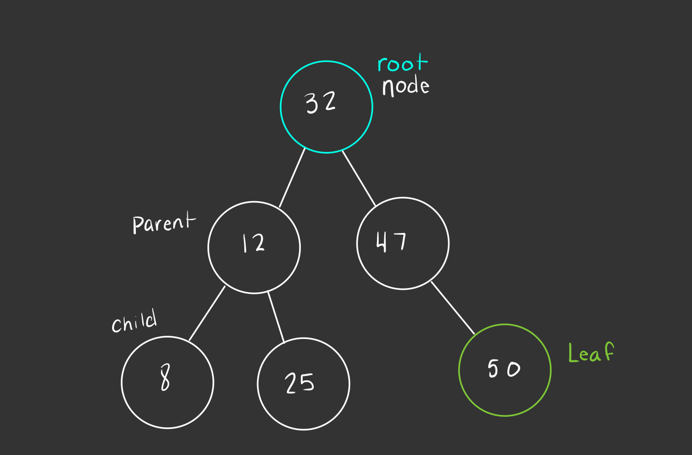
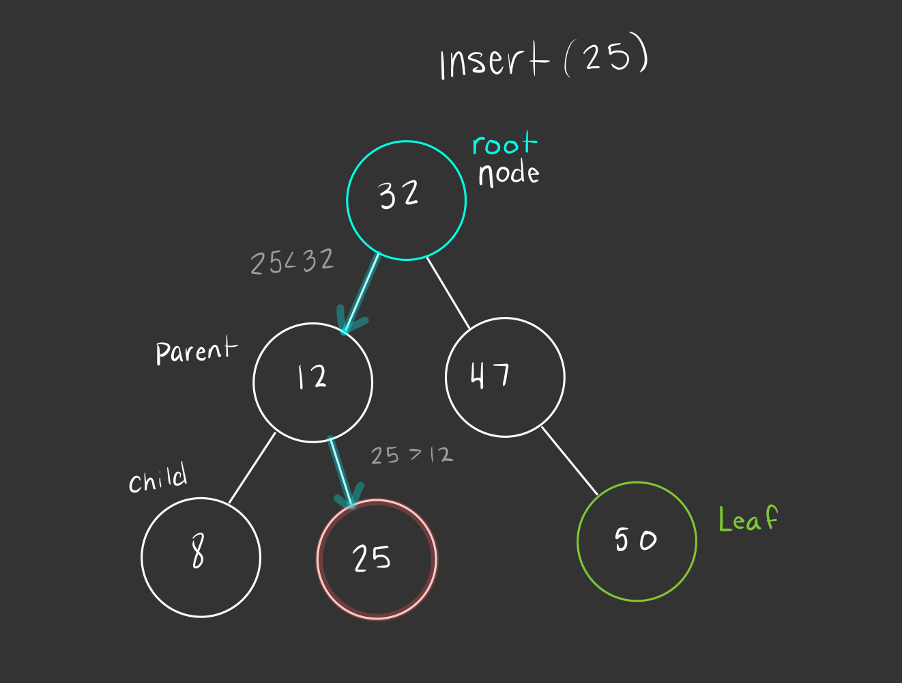

# Trees
## I. Introduction
Just as the name implies, this data structure uses the idea of tree graphs to build a new kind of relation between data. Trees in C# are built off of the array data structure. The first element or node in a tree is the root, and the nodes directly connected to it are its children. Each child node can have its own child nodes and so on. A child node with no children is called a leaf. \
The main benefit of trees that we will discuss is their ability to decrease the time it takes to search for a value.
## II. Binary Search Trees
The tree we will be practicing using today is called the **binary search tree** (BST). In a binary tree each node is only able to connect up to two nodes. However, to be a binary search tree there are additional rules the data structure must follow in order for it to be effective. When adding data to a BST, the data must be compared to the parent node. Data that is less than the parent node will be put to the left and data larger will be put to the right. In this way, data in a BST is considered sorted which allows us to develop a more efficient search algorithm. Even when adding data this way, the BST must also be balanced in order to be more efficient. To balance a tree, the difference of height between any two subtrees must be 0 if not a relatively small difference. To obtain the height of tree or subtree, we count the maximum number of nodes between the root and its leaves. 



## III. Recursion
When working with trees we often traverse them using recursion. In programming recursion happens when a function calls itself within itself. This is tricky territory, as you can easily get stuck in an infinite loop with no way out. For good practice there are two basic steps when using recursion-
1. What is the base case? Or what should the default behavior be?
2. What is the overall process being done?\
With trees often our base case will be when the function has reached the leaf. In other words, when we no longer have anywhere to go in the tree we have reached a node with no children and should no longer continue down the tree. 



## IV. Common Operations
In C# the built-in data structure for a tree is called ```SortedSet<T>```, however for the purposes of this tutorial we will provide a binary search tree class that will utilize the common operations of a search tree. 
| Common BST  Operation  | Description                               |
|------------------------|-------------------------------------------|
| ```insert(value)```    | Insert a value into the tree.             |
| ```remove(value)```    | Remove value from the tree.               |
| ```contains(value)```  | Determine if value is in tree.            |
| ```traverse_forward``` | Visit all nodes from smallest to largest. |
| ```traverse_reverse``` | Visit all nodes from largest to smallest. |
| ```height(node)```     | Determine height of a node.               |
| ```size()```           | Return size of the BST.                   |
| ```empty()```          | Returns true if root node is empty.       |
## V. Efficiency of Common Operations
The common operation *insert*, *remove*, and *contains* all have an algorithmic efficiency of O(log n). We can see this in the way these methods are implemened. For example, in order to insert something in the sorted order we need to find where the value fits. We start at the root node, compare if the value is less than or greater than the value in that current node. Based on that distinction we move to the corresponding subtree and continue until we find a leaf and insert after that node. Each time we make this distinction of greater than or less than, we remove half the data we need to inspect (as long as our tree is balanced). Remove and contains work similarly.\
The traverse methods along with the height are all O(n). This is because in these three methods each node is visited at least once. This takes place with the heigh function as it must determine and compare heights of subtrees in order to find the maximum length of a root to a leaf.\
Finally size and empty are O(1) similar to our other data structures we have discussed.
## VI. Example: Sorting Books
In the example below we will create a program that sorts books by year. 

Sorting Books Requirements:
* Add Books with title, author, and year published in sorted order.
* Able to search for book by year.
* Able to get the height of the tree.
* Able to display the books in order and reversed by year.

With this project we will have three distinct classes- BinarySearchTree, Node, and Book. Our BST is made up of nodes, and the data stored in our nodes is made up of a book. The book will keep track of the title, author and year published. We will also include an override for the ToString method that will help with displaying the values.
```c#
public override string ToString() {
    return "<Book>{" + "Title: " + this.Title + ", Author: " + this.Author + ", Year: " + this.PubYear +"}";
    }
```
The node class tracks the book value at that node, traverses the tree to find where to insert a new node, and if a value is contained in the tree. We can see how traversing the tree at the node level looks below. The Contains method will be built similarly.
```c#
public void Insert(Book value) {
    // Check if the book year is already in tree
    if (value.PubYear == Book.PubYear)
    {
        // We don't want to add the same book twice
        Console.WriteLine("Cannot Add Duplicate Years.");
        return;
    }
    if (value.PubYear < Book.PubYear) {
        // Insert to the left
        if (Left is null)
            Left = new Node(value);
        else
            Left.Insert(value);
    }
    else {
        // Insert to the right
        if (Right is null)
            Right = new Node(value);
        else
            Right.Insert(value);
    }
}
```
Our BinarySearchTree class will also have Insert and Contains methods, but their purpose will be to call the node method after checking if the tree is empty.
```c#
public void Insert(Book value) {

    // Create new node
    Node newNode = new Node(value);

    // If the list is empty, then point both head and tail to the new node.
    if (_root is null)
        _root = newNode;

    // If the list is not empty, then only head will be affected.
    else
        _root.Insert(value);
}

public bool Contains(int value) {
    return _root != null && _root.Contains(value);
}
```
The BinarySearchTree will also contain methods for traversing the data in the tree.
```c#
IEnumerator IEnumerable.GetEnumerator() {
    // call the generic version of the method
    return GetEnumerator();
}

public IEnumerator<Book> GetEnumerator() {
    var books = new List<Book>();
    TraverseForward(_root, books);
    foreach (var book in books) {
        yield return book;
    }
}

private void TraverseForward(Node? node, List<Book> values) {
    if (node is not null) {
        TraverseForward(node.Left, values);
        values.Add(node.Book);
        TraverseForward(node.Right, values);
    }
}
```
The full example can be seen [here](tree-example).\
There is a test file as well that will demonstrate the use of the program.
## VII. Problem to Solve: Sorting Books II
For this problem, we will build off of our example with books and try sorting on a different attribute such as title. 

Sorting Books Requirements:
* Add Books with title, author, and year published in sorted order by title.
* Able to search for book by title.
* Able to get the height of the tree.
* Able to display the books in alphabetical order and reversed by title.

Please use the test file in the example problem to structure your tests for your solution. Your program should test the following cases:
* Add five books to the tree.
* Add one of the same books and check that duplicates are not allowed.
* Check that the tree does contain two different books, and does not contain two different books.
* Display the books in reverse order.
* Get the height of the tree, and check that it accurately updates.

Here are some example books that can be used for testing:
* {<Book>{Title: Beyonders, Author: Brandon Mull, Year: 2011}
* <Book>{Title: Fablehaven, Author: Brandon Mull, Year: 2006}
* <Book>{Title: Kingdom of the Wicked, Author: Keri Maniscalco, Year: 2020}
* <Book>{Title: Matched, Author: Ally Condie, Year: 2010}
* <Book>{Title: Maze Runner, Author: James Dashner, Year: 2009}}
* <Book>{Title: Anne of Green Gables, Author: L. M. Montgomery, Year: 1908}}
* <Book>{Title: Matilda, Author: Roald Dahl, Year: 1988}}

See [solution](tree-solution)\
Return to [overview](0-overview.md)
